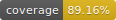

# @dbstock/exchange-network


[](https://travis-ci.com/dylanbienenstock/exchange-network)


Provides classes and types for reconstructing multiple limit order books across multiple exchanges.

This project is ***very new*** and ***very incomplete*** but fully usable in its current state.

* Use `npm run build` to build the project using the Typescript compiler.
* Use `npm test` to run unit tests with Alsatian.
* Use `npm run coverage` to generate coverage reports using Istanbul.

## Usage 📈

```
let network = new ExchangeNetwork();
let exchange = network.addExchange("Coinbase Pro");
let pair = { base: "BTC", quote: "USD" };
let market = exchange.addMarket(pair);

// The following 4 function calls do the same thing

network.recordOrder({
    exchangeName: "Coinbase Pro",
    pair: pair,
    side: Side.Bid,
    price: 4000,
    amount: 0.275
});

exchange.recordOrder({
    pair: pair,
    side: Side.Bid,
    price: 4100,
    amount: 1.655
});

market.orderBook.record({
    side: Side.Bid,
    price: 4200,
    amount: 2.3
});

market.orderBook.bids.record({
    price: 4300,
    amount: 1.705
});


let allBids = market.orderBook.bids.toArray();
let bestBid = network.getBestBidFor(pair);

console.log("All bids ⮯ \n", allBids);
console.log("\nBest bid ⮯");
console.log("Exchange name:", bestBid.exchange.name);
console.log("Price:", bestBid.price);
console.log("Amount:", bestBid.amount);
```

Output

```
All bids ⮯ 
 [ { price: 4000, amount: [ 0.275 ] },
  { price: 4100, amount: [ 1.655 ] },
  { price: 4200, amount: [ 2.3 ] },
  { price: 4300, amount: [ 1.705 ] } ]

Best bid ⮯
Exchange name: Coinbase Pro
Price: 4300
Amount: 1.705
```